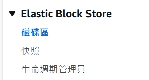
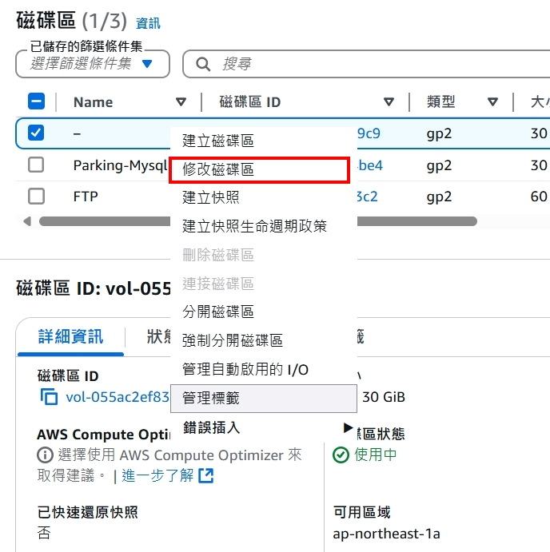
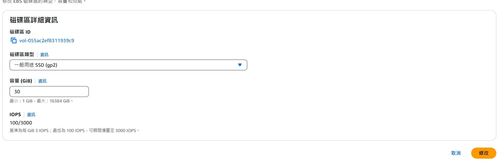

## EC2

## 調整磁碟大小

### 1. 增加磁碟容量
  

  



### 2. 配置系統容量(ubuntu)

使用
```bash
lsblk 
```
可以看到 xvda 的空間已經變成我們修改的容量了，但目前無法使用。

使用
```bash
sudo growpart /dev/xvda 1
```
擴展可用的硬碟空間配置，擴展後可以看到目前的可用空間已經擴展至正確容量。

使用 
```bash
sudo resize2fs /dev/xvda1
```
指令重新配置可用的硬碟空間，重新配置完成後，可以看到 /dev/xvda1 的空間已經變成正確容量。